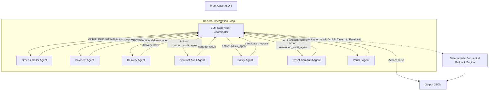

# Multi-Agent Dispute Resolution Architecture

This document describes the updated **Model 1: LLM-Based Supervisor Architecture (ReAct Loop)**, agent roles, data access permissions, handoff protocols, and fault-tolerant fallback mechanisms.

---

## System Overview

The system operates as a hybrid Multi-Agent architecture. A central **LLM Supervisor (Coordinator)** dynamically orchestrates 8 specialist agents using a reasoning loop (ReAct pattern). Five domain agents perform deterministic calculations against database tables, while three supporting agents validate the case envelope, A2A contracts, and final resolution consistency.

If the LLM endpoint experiences network latency, rate limits, or connectivity issues, the Coordinator automatically activates a **State-Preserved Deterministic Fallback Engine** to guarantee 100% case completion.



---

## Agent Roles & Responsibilities

### 1. LLM Supervisor Coordinator (`src/coordinator.py`)
*   **Role**: Central dynamic orchestrator, prompt engineer, and fall-back executor.
*   **Responsibilities**:
    *   **Dynamic ReAct Loop**: Evaluates current case state, execution history, and determines the next agent tool to trigger (`order_seller_agent`, `payment_agent`, `delivery_agent`, `policy_agent`, `verifier_agent`).
    *   **Zero-Dependency LLM Client** (`src/llm.py`): Connects to OpenAI-compatible endpoints (`gpt-4o-mini`, `qwen-2.5-7b-instruct`, `llama-3.1-8b-instant`) using Python's built-in `urllib.request`.
    *   **Automatic Retry & Backoff**: Handles HTTP 429 / Rate-Limit errors with exponential backoff delays.
    *   **Regex JSON Extractor**: Extracts raw `{...}` JSON blocks if LLM outputs markdown text or floats.
    *   **Automated Reminder Retry**: Re-prompts the LLM with strict hints if it returns non-JSON responses.
    *   **Deterministic Fallback**: Preserves already gathered facts and runs remaining agents sequentially if LLM API connection fails.
    *   **Trace Logger Integration** (`src/trace.py`): Logs all agent handoff events to `logging/trace.jsonl` and `trace.jsonl`.

### 2. Order & Seller Agent (`src/agents/order_seller_agent.py`)
*   **Role**: Order baseline retrieval and seller SLA evaluation.
*   **Responsibilities**:
    *   Queries `olist_orders_dataset.csv`, `olist_order_items_dataset.csv`, and `olist_sellers_dataset.csv`.
    *   Calculates `item_total_brl` and `freight_total_brl`.
    *   Detects if carrier handoff (`order_delivered_carrier_date`) exceeded seller SLA (`shipping_limit_date`).

### 3. Payment Agent (`src/agents/payment_agent.py`)
*   **Role**: Financial auditing and split payment reconciliation.
*   **Responsibilities**:
    *   Queries `olist_order_payments_dataset.csv`.
    *   Aggregates total payments (`payment_total_brl`) across sequential payments.
    *   Reconciles payments against item + freight totals within a `0.10 BRL` margin.

### 4. Delivery Agent (`src/agents/delivery_agent.py`)
*   **Role**: Delay attribution and logistics analysis.
*   **Responsibilities**:
    *   Compares customer delivery date against estimated date.
    *   Attributes delay responsibility to `"seller"` (if carrier handoff was late) or `"logistics_provider"` (if carrier handoff was on time).

### 5. Policy Agent (`src/agents/policy_agent.py`)
*   **Role**: Applying business policy (`EC_POLICY_V1`).
*   **Responsibilities**:
    *   Evaluates the six prioritized dispute resolution rules.
    *   Determines `primary_issue`, `responsible_parties`, `recommended_refund_brl`, and `resolution_actions`.

### 6. Verifier Agent (`src/agents/verifier_agent.py`)
*   **Role**: Output verification and zero-hallucination validation.
*   **Responsibilities**:
    *   Cross-references `evidence_ids`, entity IDs, and financial figures directly against the Olist CSV dataset.
    *   Ensures 100% compliance with data schemas and mathematical consistency.

### 7. Supporting Sub-agents

*   **Input Validation Agent** (`src/agents/input_validation_agent.py`): checks the
    required case envelope and supported policy version before data access.
*   **Contract Audit Agent** (`src/agents/contract_audit_agent.py`): checks that
    order, payment and delivery handoffs preserve required IDs and facts.
*   **Resolution Audit Agent** (`src/agents/resolution_audit_agent.py`): independently
    checks that the Policy Agent's issue, refund, status and action agree with
    `EC_POLICY_V1` before the dataset-backed Verifier Agent runs.

These agents are validation-only. They do not infer missing CSV events, select a
different policy rule, or replace the Policy/Verifier agents.

---

## Data Access Matrix

| Agent | Accessed CSV Files | Data Contract Interface |
|---|---|---|
| **LLM Supervisor** | *None (reads case JSON and agent outputs)* | Dynamic ReAct JSON Schema |
| **Order & Seller** | `olist_orders_dataset.csv`<br>`olist_order_items_dataset.csv`<br>`olist_sellers_dataset.csv` | `order_id`, `item_total_brl`, `freight_total_brl` |
| **Payment** | `olist_order_payments_dataset.csv` | `order_id`, `item_total_brl`, `freight_total_brl` |
| **Delivery** | *None (receives order facts from contract)* | `order_facts` dictionary |
| **Policy** | *None (receives facts from Order, Payment, Delivery)* | `EC_POLICY_V1` rules engine |
| **Verifier** | `olist_orders_dataset.csv`<br>`olist_sellers_dataset.csv`<br>`olist_order_items_dataset.csv`<br>`olist_order_payments_dataset.csv` | Full dataset schema & evidence verification |
| **Input Validation** | *None* | Case envelope and policy version |
| **Contract Audit** | *None* | Cross-agent A2A handoff consistency |
| **Resolution Audit** | *None* | Issue/refund/status/action consistency |

---

## Handoff & Fallback Protocol

### 1. Dynamic LLM Handoff Loop
```json
{
  "thought": "I have gathered order facts. Now I need to reconcile payment totals.",
  "next_action": "payment_agent",
  "action_input": {
    "item_total_brl": "100.00",
    "freight_total_brl": "15.00"
  }
}
```

### 2. Trace Logging Specification
Every handoff event (both in LLM mode and Fallback mode) is logged in JSONL format:
```json
{"timestamp": "2026-08-05T12:37:29+07:00", "case_id": "EC_027", "event": "agent_handoff", "from_agent": "coordinator", "to_agent": "payment_agent", "status": "started"}
{"timestamp": "2026-08-05T12:37:29+07:00", "case_id": "EC_027", "event": "agent_handoff", "from_agent": "payment_agent", "to_agent": "coordinator", "status": "success"}
```

### 3. Fault-Tolerant Execution
- **LLM Error Handling**: On HTTP 429, retry up to 5 times with exponential sleep delays.
- **Regex Extraction**: If LLM outputs markdown-wrapped JSON or float numbers, Regex extracts `{...}` automatically.
- **Fallback Activation**: If max retries or 8 loop iterations are reached, state-preserved sequential execution runs any missing agents to guarantee 100% case output validity.
